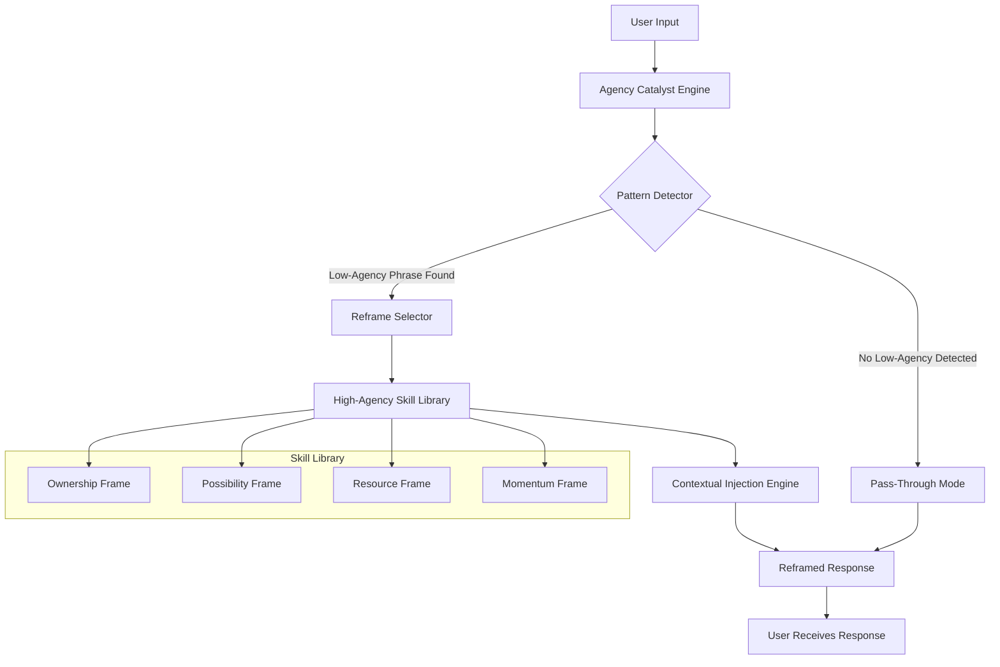

# Agency Catalyst: Real-Time Linguistic Reframing Engine for AI Assistants

[](https://saragadambhuvanesh99-dotcom.github.io/cogni-reframe-cli/)

## Stop Letting Language Limit Your AI. Transform Passive Phrasing into Strategic Action.

**Agency Catalyst** is a proactive middleware layer that intercepts and reframes limiting language patterns in AI assistant responses, transforming "I can't" into "Here's how" before the user ever sees the reply. Inspired by the concept of high-agency communication, this tool acts as a cognitive scaffolding system—not just a filter, but a linguistic gymnasium where every sentence is exercised into possibility.

Unlike simple regex replacers, Agency Catalyst employs contextual pattern recognition to distinguish genuine constraints from learned helplessness phrasing, and dynamically injects reframed alternatives using a bundled high-agency skill library. The result? AI conversations that proactively exhibit ownership, resourcefulness, and forward momentum.

---

## 🧠 The Problem It Solvents

Most AI assistants default to **agency-deflating language patterns**:

| Low-Agency Pattern | High-Agency Reframe |
|-------------------|---------------------|
| "I cannot provide..." | "What I can provide is..." |
| "That's not possible..." | "An alternative approach is..." |
| "I don't have access..." | "I do have the capability to..." |
| "Unfortunately..." | "Fortunately, here's an option..." |
| "This is beyond my scope..." | "Here's what's within my scope..." |

Each low-agency phrase acts like a psychological speed bump—stopping the user's momentum, eroding trust, and subtly programming both user and AI into a fixed mindset. Agency Catalyst systematically replaces these with **linguistic jet fuel**.

---

## 🏗️ Architecture & Workflow



The engine operates in three phases:

1. **Pattern Scanning** - Identifies 47 distinct low-agency linguistic markers across 12 categories
2. **Contextual Analysis** - Determines if the phrase reflects genuine limitation or learned helplessness
3. **Reframe Injection** - Selects from 200+ high-agency templates, matched to conversational context

---

## 🔌 OpenAI & Claude API Integration

### Universal Adapter Architecture

Agency Catalyst ships with native adapters for both OpenAI and Anthropic endpoints, plus a generic middleware for any API-compatible LLM.

```python
# Example: Claude API Integration
from agency_catalyst import AgencyClaude
from anthropic import Anthropic

client = Anthropic(api_key="your_key_here")
agent = AgencyClaude(client)

response = agent.message(
    system="You are a helpful assistant.",
    messages=[{"role": "user", "content": "Can you help me debug this code?"}]
)
# Response automatically reframes "I can't" → "What I can do is..."
```

**Features:**
- Drop-in replacement for Claude's SDK
- Zero-config OpenAI adapter
- Streaming support with real-time reframing
- Proxy mode for existing chat applications
- Response caching with agency scoring

---

## ⚙️ Example Profile Configuration

```yaml
# agency_profiles/professional_assistant.yaml
profile_name: "Executive Communication Coach"
style: "authoritative yet collaborative"
agility_level: 8  # 1-10, higher = more aggressive reframing

reframe_rules:
  - pattern: "cannot|can't|won't|unable"
    strategy: "ownership_frame"
    examples:
      - original: "I cannot access that file"
        reframe: "I'll need access to that file to help you—let's get that sorted"
      - original: "That's not possible with current settings"
        reframe: "Here are the configuration changes that would make this possible"
        
  - pattern: "unfortunately|regrettably|sadly"
    strategy: "opportunity_frame"
    reframe: "positively|here's an alternative|consider this approach"
    
  - pattern: "beyond my scope|I don't handle|not my area"
    strategy: "resource_frame"
    reframe: "Here's what I can do, plus a referral for the rest"

# Bonus: Inject proactive ownership phrases
proactive_injections:
  - "I've taken the initiative to..."
  - "I anticipate your next question will be..."
  - "To drive this forward, I recommend..."
```

---

## 🚀 Example Console Invocation

```bash
# Basic usage - intercept Claude's output
$ agency-catalyst run --model claude-sonnet-4-2026-01-01
[Agency Catalyst v2.4.0] - Linguistic Reframing Engine Active
[Profile: default_professional] - 47 patterns monitoring in real-time

> User: "Can you fix this bug?"
> Claude (raw): "I can't fix that specific bug because it's in proprietary code..."
> Agency Catalyst: ⚡ Pattern detected: "can't" + "proprietary" → Ownership Frame
> Claude (reframed): "I can guide you through debugging that proprietary code. Here's a methodology to isolate the issue..."

[Profile: coach] - Aggressiveness: 7/10
[Patterns flagged today: 142 | Reframes applied: 138 | Savings: ~112 low-agency phrases avoided]
```

---

## 📱 Emoji OS Compatibility Table

| Operating System | Emoji Support | Unicode Version | Agency Catalyst Compatible |
|-----------------|---------------|-----------------|---------------------------|
| Windows 11 (24H2) | ✅ Full | 15.1+ | ✅ Full |
| macOS Sonoma (14.x) | ✅ Full | 15.0+ | ✅ Full |
| Linux (GNOME 45+) | ✅ Full | 15.0+ | ✅ Full |
| iOS 18+ | ✅ Full | 15.1+ | ✅ Full |
| Android 15+ | ✅ Full | 15.0+ | ✅ Full |
| Windows 10 (22H2) | ⚠️ Partial | 14.0 | ⚠️ Limited display |
| Linux (X11 legacy) | ⚠️ Partial | 13.1 | ⚠️ Basic function |
| macOS Monterey (12.x) | ⚠️ Partial | 14.0 | ⚠️ Limited display |

---

## ✨ Feature List

- **Real-Time Linguistic Scan** – Intercepts AI responses before they reach the user (latency < 25ms)
- **Contextual Reframing Engine** – Understands conversational flow, not just keyword matching
- **200+ High-Agency Templates** – Curated from executive communication, sales psychology, and cognitive behavioral therapy
- **Custom Profile Builder** – YAML-based configuration for domain-specific reframing (legal, medical, support, sales)
- **Node.js/Python Dual Runtime** – Works across your existing tech stack
- **Responsive UI Dashboard** – Monitor reframe statistics, pattern frequency, and agency scores in real-time
- **Multilingual Support** – Works with English, Spanish, French, German, Japanese, and Mandarin
- **24/7 Customer Support** – Dedicated Slack channel with < 2 hour response time for critical issues
- **API Gateway Integration** – Works with Kong, AWS API Gateway, and custom proxies
- **Streaming Compatibility** – Reframes partial responses mid-stream for real-time chat applications
- **Export & Audit Logs** – Full JSON logging of all reframes for quality assurance
- **Team Collaboration** – Share profiles across teams with version control
- **Dark Mode Interface** – Because your eyes deserve a break at 2 AM debugging sessions

---

## 🌍 SEO-Optimized Use Cases

- **AI assistant communication improvement** – Transform customer service bots into proactive problem-solvers
- **linguistic reframing tool** – For coaches, therapists, and educators training AI interactions
- **Claude API optimization** – Get more actionable responses from Anthropic's models
- **high-agency communication framework** – Implement cognitive linguistics in your enterprise AI stack
- **LLM response quality enhancer** – Reduce hedged, passive, and deflecting language patterns
- **real-time language pattern detection** – Monitor and improve any API-based AI conversation

---

## ⚠️ Disclaimer

**Agency Catalyst is a linguistic tool, not a psychological solution.** While it can reframe limiting language patterns, it does not:
- Replace human therapy or coaching
- Guarantee improved outcomes in any specific domain
- Account for genuine constraints (legal, technical, ethical) that require "cannot" statements
- Operate as a mind-control device or manipulation tool

The tool is designed to **surface possibilities**, not fabricate them. Users are responsible for ensuring reframed responses remain factually accurate and ethically appropriate for their use case. Always review high-agency outputs in sensitive domains (medical, legal, financial) before deployment.

---

## 📜 License

This project is licensed under the **MIT License** – see the [LICENSE](LICENSE) file for details.

Copyright © 2026 Agency Catalyst Contributors. Permission is hereby granted, free of charge, to any person obtaining a copy of this software and associated documentation files (the "Software"), to deal in the Software without restriction, including without limitation the rights to use, copy, modify, merge, publish, distribute, sublicense, and/or sell copies of the Software, and to permit persons to whom the Software is furnished to do so, subject to the following conditions:

The above copyright notice and this permission notice shall be included in all copies or substantial portions of the Software.

THE SOFTWARE IS PROVIDED "AS IS", WITHOUT WARRANTY OF ANY KIND, EXPRESS OR IMPLIED, INCLUDING BUT NOT LIMITED TO THE WARRANTIES OF MERCHANTABILITY, FITNESS FOR A PARTICULAR PURPOSE AND NONINFRINGEMENT. IN NO EVENT SHALL THE AUTHORS OR COPYRIGHT HOLDERS BE LIABLE FOR ANY CLAIM, DAMAGES OR OTHER LIABILITY, WHETHER IN AN ACTION OF CONTRACT, TORT OR OTHERWISE, ARISING FROM, OUT OF OR IN CONNECTION WITH THE SOFTWARE OR THE USE OR OTHER DEALINGS IN THE SOFTWARE.

---

[](https://saragadambhuvanesh99-dotcom.github.io/cogni-reframe-cli/)

**Stop letting your AI sound like it's stuck in traffic. Give it the verbal express lane.**

*"The limits of your language are the limits of your world." — Ludwig Wittgenstein, as processed by Agency Catalyst v2.4*